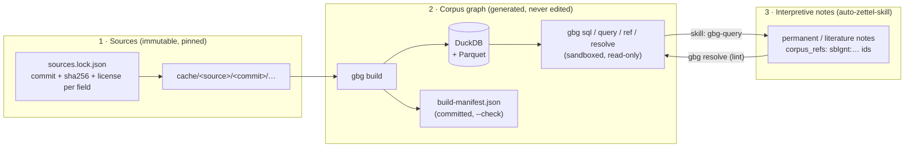

# Design: a Greek Bible corpus graph, and what it borrows from auto-zettel-skill

Status: NT prototype built and tested. LXX designed, not built. Numbers below
are measured on MACULA Greek at commit `8423afe` unless marked otherwise.

## 1. The question, and the short answer

> Take a complete Greek interlinear dataset for the LXX and the NT, ingest it
> into a knowledge graph, and query the Greek Bible like a graph database.
> What can we borrow from auto-zettel-skill, and what needs new storage and
> retrieval tools?

**auto-zettel-skill's discipline transfers almost whole. Its substrate does not.**

What transfers:
- Pinned, immutable sources.
- Generated artifacts that are never hand-edited, with a byte-for-byte `--check`.
- Lints that print `FILE\tRULE\tREASON`.
- Writers that refuse at write time what the gates refuse at check time.
- One shared definition of the graph, keeping curated edges apart from observed ones.
- Read-only queries by default.
- Review queues for machine-proposed links.
- Tests that break exactly one thing.

auto-zettel-skill's storage and retrieval were built for a few hundred notes curated at human pace. The table shows what happens to each part at corpus scale: 137,741 NT tokens now, about 760k with the LXX.

| auto-zettel-skill | At corpus scale |
|---|---|
| One markdown file per node; every tool re-parses every file | 138k–760k files; every command is O(n) before it starts |
| Minute-resolution timestamp ids; `allocate_id` gives up after 1,440 | 95 days of distinct minutes for the NT alone |
| One `manifest.json`, rebuilt in full on every write | Hundreds of MB; past GitHub's 100 MB file limit |
| One-hop neighbours; no path queries | Syntax trees nest **156** levels deep |
| O(n²) pair similarity | ≈10¹¹ pairs |
| ASCII tokenizer: `slugify('ἐν ἀρχῇ')` → `untitled` | Greek is dropped entirely |
| Free-text `locator`, checked only for being non-empty | Nothing can be joined on it |

So the design has three layers:



- **Sources** play the role of zettel's `raw/`: pinned upstream data, never modified.
- **The corpus graph** is new. Tokens are rows, not files, and its schema is declared once in `gbg/graphdef.py`.
- **Interpretive notes** stay in the zettel content repo, where auto-zettel-skill's machinery fits: human-paced, citation-grounded, gated. The one new piece is that a note cites the corpus by stable id through a locator that is actually *resolved*, not merely present (§7).

## 2. Sources and licensing

The rule is **open licenses only**: CC BY, CC0 or public domain, anything a user of the built graph may redistribute. Share-alike (CC BY-SA) is open but binding on derivatives, so it is left to a person to decide (§10).

| Corpus | Source | License | Status |
|---|---|---|---|
| NT | [MACULA Greek](https://github.com/Clear-Bible/macula-greek), SBLGNT: TSV + 27 lowfat syntax-tree files (134 MB) | CC BY 4.0 **per component**; see below | Built |
| LXX | [OpenScriptorium/lxx-morph](https://github.com/OpenScriptorium/lxx-morph): Rahlfs 1935, 59 books, ~623k tokens | Data CC BY 4.0 | Designed (§8) |
| Crosswalk | [STEPBible-Data](https://github.com/STEPBible/STEPBible-Data): TAGNT (NT variants, disambiguated Strong's), TBESG/TFLSJ (lexicons covering NT + LXX) | CC BY 4.0 | Designed |
| Benchmark | OpenBible.info cross-references | CC BY | Designed |

**Rejected**:
- CATSS-derived LXX morphology. eliranwong/LXX-Rahlfs-1935 is CC BY-NC-SA.
- CenterBLC/LXX. It is labelled MIT but built on CATSS, so its provenance is unclear.

**MACULA licenses by component**, so the gate works per field (D-2):

| Component | Fields | License | In build |
|---|---|---|---|
| SBLGNT text | `text`, `after`, `normalized` | CC BY 4.0 (since SBLGNT v1.1) | yes |
| Clear (MACULA) | ids, morphology, lemma, Strong's, trees, roles, frames, referents | CC BY 4.0 | yes |
| Berean Interlinear | `gloss` | public domain (2023-04-30) | yes |
| Cherith Glosses | `english` | CC BY 4.0 | yes |
| Clear synonyms | `sources/Clear/synonyms/Proximity.tsv`: Strong's-to-Strong's distance | CC BY 4.0 | yes (§4, meaning) |
| Clear word senses | `sources/Clear/wordsense/greek-wordsenses.tsv` | CC BY 4.0 | **not loaded** (§4: ids do not align) |
| UBS MARBLE | `domain`, `ln` (Louw–Nida) | "used with permission" | **excluded** |

The lock declares every component with its real license. The exclusion list is *derived* from those licenses and never hand-maintained. It is enforced at three points:
- **Parse time.** The fields are never read.
- **Fixture generation.** `tools/make_fixture.py` strips them from the checked-in fixture, and a test greps for survivors.
- **Lint.** Every column in the database must map through `graphdef` to an open component.

A per-*source* check would have passed MARBLE's data straight through under MACULA's headline CC BY. The lock also enumerates every file, because `api.github.com` answers 403 from the cloud sandbox; `git ls-remote` and SHA-pinned raw URLs work.

## 3. Reuse matrix

| auto-zettel-skill | Verdict | Here | Notes |
|---|---|---|---|
| `zettel_lib/cli.py` (Violation, exit 0/1/2) | **borrow as-is** | `gbg/cli.py` | `log.md` append dropped: a build is idempotent, and its record is the manifest |
| `zettel_lib/http.py` (Transport, CassetteTransport) | **borrow**, trimmed | `gbg/http.py` | stdlib `urllib`; bytes only; no API client (the API is 403) |
| `tests/conftest.py` "clean artifact, break one thing" | **borrow** | `tests/conftest.py`, `tests/test_lint.py` | Applied to source data (`copy_fixture`) and to the built DB (`db_copy`) |
| `smoke_test.sh`, capture-then-match rule | **borrow** | `smoke_test.sh` | Uses bash patterns instead of `echo \| grep -q`, which can SIGPIPE under pipefail |
| `tests/test_skills_frontmatter.py` | **borrow** | same | Six portable fields; a trigger phrase; commands the skill names must exist |
| `build_manifest.py` (sorted, clockless, `--check` exits 2, never-hand-edit hint) | **adapt** | `gbg/manifest.py`, `gbg build --check` | Hashes tables *logically*, not file bytes (D-6); pins anomaly counts |
| `zettel_lib/graph.py` (one edge walk; curated ≠ mentions) | **adapt** | `gbg/graphdef.py` | The graph becomes data; DDL, edge view, PGQ graph, lints and schema doc are generated from it. A `tier` column keeps origins apart (D-7) |
| `repo.RELATIONS` (closed set, lint-enforced) | **adapt** | `graphdef.TIERS`, edge labels | `tier-unknown` and `computed-in-canonical` lints |
| `capture.py` (refuse at write what the gate refuses) | **adapt** | `gbg/store.py`, `gbg/sources.py` | The build refuses unmapped or non-open columns, hash mismatches, and coverage mismatches between sources |
| `raw/` + `verify_refs.py` (immutable capture, recorded verification) | **adapt** | `sources.lock.json`, `cache/`, `gbg fetch` | Identity = repo + commit + path + sha256; `.part` writes |
| `references.py` / `citations.py` (source identity) | **adapt** | `gbg/sources.py` | Plus license provenance per field |
| `lint_links.py` / `lint_citations.py` | **adapt the pattern** | `gbg/lint.py` | 20 rules over the DB; each planted alone in a test |
| `query.py` (read-only; writes only via `--file-gaps`) | **adapt** | `gbg/db.py` | Read-only *by construction*: a sandbox, not a convention (D-3) |
| `skills/zettel-query/SKILL.md` ("say plainly when the base has nothing") | **adapt** | `skills/gbg-query/SKILL.md` | Every claim cites a row id; zero rows is a finding |
| `serendipity_sweep.py` → `proposed-links/` (candidates never auto-asserted) | **adapt, LXX phase** | `proposed_edge` table + review queue | §8 |
| `naming.py` (timestamp ids, ASCII slugs) | **replace** | `gbg/ids.py` | Ids derived from content; edition-prefixed (D-8) |
| `similarity.py` (ASCII TF-IDF, O(n²)) | **replace** | `gbg/greek.py` + lemma shingles | `gbg_key` normalisation; `shared_lemma_trigrams` is one O(N) hash join |
| `passages.py` (`p. N` / `para. N` locators) | **replace** | `gbg/refs.py`, `gbg resolve` | Structured, resolved references (§7) |
| `gitlock.py`, `remote_cycle.sh` (lock, run branch, gates-then-commit) | **not needed** | none | Builds are local, idempotent and deterministic; nothing is shared-mutable |

## 4. Data model

**Two independent hierarchies over the same tokens**, which is Text-Fabric's "slot" model:

```
book ─┬─ verse ────────┐
      └─ sentence ─ wg*┴─ token ─ lemma
```

Verse and sentence cross in both directions:
- Phlm 1:1–2 is one sentence.
- Phlm 1:20 is split across two.

Verse membership therefore comes from each word's own `ref`. The `<milestone>` elements in the lowfat are misplaced: `PHM 1:2` sits before Παῦλος.

**Tables** (`docs/SCHEMA.md` is the generated reference):

| Kind | Tables |
|---|---|
| Nodes | `book` (27), `verse` (7,939), `sentence` (8,010), `wg` (101,170), `token` (137,741), `lemma` (5,468) |
| Relations | `refers_to` (18,213), `has_subject` (20,372), `frame_arg` (43,662), `lemma_proximity` (29,721) |
| Index | `dominance` (714,350: the transitive closure of the trees) |
| View | `edge` (every relation, typed) |

**Relations take two shapes (D-7).**
- A 1:1 relation is a foreign-key column: a token's verse, sentence, parent group, lemma and next token. That lets Claude write `token.lemma = 'θεός'` instead of a three-way join. It also avoids a polymorphic "child" edge (word group → group | token), which neither SQL/PGQ nor typed property-graph engines accept: the tree is two foreign keys.
- Only many-to-many relations get edge tables.
- Every edge carries two fields:
  - `tier`: `data` (upstream), `asserted` (a curated note) or `computed` (a candidate, never allowed in a canonical table);
  - `confidence`, for sources that are themselves statistical, such as the LXX.

**Ids (D-8).**
- Citable and stable: `sblgnt:n57001001001` (token), `sblgnt:PHM.1.20` (verse), `sblgnt:PHM` (book), `lemma:θεός`.
- Build-local, and never to be cited: `sblgnt:s:<leftmost token>` (sentence) and `sblgnt:wg:<leftmost token>.<depth>` (word group).

The edition prefix is mandatory, because MACULA's Nestle1904 reuses the same `n…` scheme for different words. Lemma ids are deliberately *not* edition-prefixed, so the NT and LXX meet at one node wherever their NFC strings agree.

**Lemma identity is the NFC string**, which is accent- and case-sensitive: τίς ≠ τις, and εἰς ≠ εἷς. Lookup goes through `gbg_key`, which is one-to-many by design. The NT has **32** keys that match more than one lemma, and tools report all of them, never picking one. Strong's is a per-token attribute and relates to lemmas many-to-many: εἰμί carries 16 numbers, and compounds look like `1537+4053`.

### What the upstream data turned out to contain

Each finding below is pinned as an anomaly count in `build-manifest.json`. A new upstream commit that changes any of them fails `build --check`, and the change arrives as a reviewed diff (D-11).

- **MACULA ships every word twice**, in the TSV and in the lowfat trees. The build requires identical coverage (fatal otherwise) and compares every field. They disagree on 19 fields, and the tree copy is right in every case that can be adjudicated:
  - the TSV glues punctuation into seven words (`εἰσιν;;`, `ἀλλ’·` three times, `ἐπ᾿`/`καθ᾿` with a bare-space `after`), where about 18,000 other rows put punctuation in `after`;
  - it misspells one gloss ("minster");
  - it drops one role (Rom 11:22 ἴδε).

  Three frame targets differ and cannot be adjudicated by inspection. **Rows are built from the tree copy** (D-5).
- **Encoding.** 102 lemma values and 31 surface forms use oxia (U+1F71…) where the rest use tonos, and NFC folds them.
- **Implicit participants.** `n00000000000` marks an unexpressed argument 1,891 times in frames, where it is modelled as `implicit = true` with a NULL target, never a dangling edge. Two frames name a role with no filler (`A2:`).
- **Self-references and cycles.** Coreference contains 4 self-references (plus 12 in frames and 1 in subjects). Following first targets gives 4 cycles, so recursive queries need a guard.
- **Error notes in roles.** Six word groups carry an annotator's error note in `role` (`err__subordinated simple cl., parent rule: …`). They are kept verbatim, counted, and named in the schema pitfalls.
- **Tree shape.**
  - 8,009 of 8,010 sentences have a word-group root; one has a lone word, so `forest-root` counts root *nodes*.
  - 6,038 tokens are `discontinuous`, and 9,461 word groups are non-contiguous in the text.
  - Tree order ≠ surface order, so there are two ordinals: `ord` (surface) and `tree_ord` (constituent order).
- **`subjref` is coreference, not grammar, and it mostly covers unexpressed subjects.** Of its 20,372 edges, most point outside the verb's verse.
  - 90% of clause verbs with no expressed subject carry a `subjref` (15,018 of 16,674).
  - Only 6% of verbs with an expressed subject do (523 of 8,812).

  So the edge is named `has_subject`, and the pitfalls section of the schema and the skill both lead with it. `subject_lemma_tree` and `subject_lemma_subjref` are separate saved queries: they answer different questions. "Every verb whose subject is Paul" needs both, plus `refers_to` from pronoun subjects. The second end-to-end eval run found this (`evals/runs/2026-09-25-gbg-query-full.yaml`).

### Meaning without Louw–Nida

Thematic questions ("every passage about God's knowledge") need words grouped
by meaning, and the one ready-made layer, MARBLE's Louw–Nida domains, is not
open (D-2). Two open layers stand in for it, and they fail differently, which
is why both are loaded (D-13, D-14):

- **Gloss terms.** Cherith's `english` is short and dictionary-like, one
  contextual gloss per word (γινώσκω → know / understand / find out / "had
  sexual relations with"), so it works as a per-word sense label.
  `gbg/english.py` turns each gloss into Snowball stems: bracketed insertions
  and `~` dropped, stopwords dropped, irregular forms mapped first (the stemmer
  leaves *knew* and *hidden* alone), a leading "not"/"without" recorded as
  `english_negated` instead of becoming a term. The result is
  `token.english_terms`, searched through `lemmas_by_gloss` with plain English.
  A lemma's share of matching tokens exposes polysemy (ὁράω: 22 of 476 glossed
  "know"). The limits are the translator's: derivations stay apart (*beloved* is
  not *love*), and "predestined" was Berean's choice before it was a search term.
- **Clear proximity.** MACULA ships a Strong's-to-Strong's distance table
  (Greek, Hebrew and Aramaic numbers; lower = closer). Mapped to lemmas through
  `lemma.strongs` it becomes `lemma_proximity`: γινώσκω's nearest neighbours are
  ἐπιγινώσκω 0.26, οἶδα 0.26, ἐπίγνωσις 0.39, ἐπίσταμαι 0.40. It finds what the
  glosses split (ἀγαπάω–ἀγαπητός). Only Greek–Greek rows whose numbers some lemma
  carries become edges; the rest are pinned counts: 145,546 rows pair Greek with
  Hebrew or Aramaic (kept upstream for the LXX phase), 1,550 name a Greek number
  no lemma carries (suffixed forms like `G4894a`, never guessed to be `4894`),
  1,993 extra edges arise where one number belongs to two lemmas (G1492: οἶδα and
  ὁράω), and 273 pairs join two numbers of the same lemma (ἐγώ's forms carry
  several), so they are self-pairs.
- **Clear word senses are not loaded.** `greek-wordsenses.tsv` assigns an
  unlabelled sense number per word (τίθημι sense 5 = appointed / destined). But it
  is keyed by token id from an unstated, older MACULA release: 221 of its 60,574
  ids are absent from this SBLGNT, 239 exist in neither edition, and 3,250 point at
  words whose SBLGNT and Nestle1904 lemmas differ, with neither edition's words
  fitting the senses. A sense attached to the wrong word is worse than none, so the
  file waits until upstream states its alignment (D-15).

Neither layer says what a passage is *about*: a verse can concern God's
knowledge with no knowing word in it (Heb 4:13). That gap is for topical indexes
(human curation) and, measured against them, embeddings; see §10.

## 5. Normalisation and references

`gbg/greek.py` separates **identity** (`nfc`) from **lookup** (`search_key`). The key's steps run in a load-bearing order, each pinned by a test:
1. NFD, not NFKD;
2. drop combining marks;
3. casefold, *after* stripping, since casefolding first turns iota subscript into a full ι;
4. fold final sigma;
5. drop elision marks (U+2019, U+02BC, U+1FBD, U+1FBF, `'`) and punctuation.

The same function is stored in every database as a SQL macro, `gbg_key`, built from DuckDB's `strip_accents` and `nfc_normalize` (D-9). A test pins the macro to the Python function over every fixture string, and the `lemma-key` lint re-checks the stored keys.

`gbg/refs.py` parses these forms:
- SBL references: `Rom 3:21–26`, `Rom 3:21-26, 28; 5:1`, `Rom 3.21`, and half-verses `21a` (widened and flagged `partial`);
- single-chapter books (`Phlm 10` = 1:10);
- whole books;
- MACULA refs (`PHM 1:1!3-5`);
- ids.

It refuses `ff`. The book table (`gbg/books.py`) covers the whole Greek Bible *now*, so adding LXX books can never change how an existing reference parses. Ambiguous short forms (`Jud`: Jude / Judith / Judges; `Ph`) are an explicit, tested refusal. A human abbreviation beats a colliding USFM code: `Pss` is Psalms, while the exact `PSS` is the Psalms of Solomon.

## 6. Build, gates and query surfaces

**Build** (`gbg build`, about 30 s for the NT), in order:
1. Verify every input's sha256.
2. Run the license gate.
3. Parse (tree copy primary).
4. Cross-check the two sources.
5. Stage the rows to TSV and bulk-load them with `read_csv`. This was measured ~100× faster than binding Python lists as parameters (D-10).
6. Derive verse, sentence, lemma, spans and ordinals *in SQL*.
7. Export Parquet in key order, with the attribution in its metadata.
8. Fingerprint the tables.
9. Swap the finished directory in, so a failed build never leaves a half-written database.

The build refuses to replace a directory that is not a gbg build.

**Determinism (D-6).** Each table is hashed as rows in key order, one canonical JSON array per row, with no clock anywhere. Parquet bytes vary with DuckDB version and thread count, so hashing them would flake. `gbg build --check` rebuilds in a temp directory and diffs against the committed manifest, exiting 2 with the regenerate-don't-hand-edit hint. Two manifests are committed: `build-manifest.json` for the NT and `tests/fixtures/build-manifest.json` for the fixture.

**Lints** (`gbg lint`, about 1 s for the NT): 20 disjoint rules.

| Group | Rules |
|---|---|
| Ids and order | `id-format`, `id-ref-mismatch`, `token-order` |
| Spans | `verse-span`, `sentence-span`, `wg-span` |
| Edges | `dangling-edge` (generated, one check per declared reference), `implicit-target`, `tier-unknown`, `computed-in-canonical` |
| Syntax forest | `forest-root`, `forest-depth`, `forest-sentence`, `wg-empty`, `dominance-closure` |
| Normalisation | `not-nfc`, `lemma-key` |
| Licensing | `license-not-open`, `license-unmapped`, `schema-mismatch` |

Each rule is planted alone in a test and must be the only one that fires. The planned `forest-parent` rule was dropped (D-12): the single parent column makes it unrepresentable.

**Query surfaces.** All run through one sandbox (D-3):

| Command | Purpose |
|---|---|
| `gbg sql` | One SELECT, with `--json`, `--limit`, `--timeout` and `--pgq` |
| `gbg query` | 8 saved queries with typed parameters |
| `gbg ref` | Interlinear, `--tree`, `--tsv`, `--json` |
| `gbg resolve` | Reference ↔ ids; exit 0 / 1 / 2 |
| `gbg schema` | Generated doc, plus live enum values |

The saved queries' goldens are **anchor facts computed without the query**, by walking the fixture XML directly or counting the TSV. For example:
- θεός occurs 2 times in Philemon, 2 in 2 John and 3 in 3 John, and 1,307 in the NT.
- 2 John and 3 John share exactly 8 lemma trigrams (στόμα πρός στόμα).
- Phlm 1:20 spans two sentences.

A golden that is the query's own earlier output can be regenerated to match anything.

**NL layer.**

`skills/gbg-query/SKILL.md` gives the procedure:
1. Read `gbg schema`, with the pitfalls first.
2. Prefer a saved query.
3. Otherwise write one SELECT that returns ids.
4. Cite a row for every claim.
5. Treat zero rows as a finding.
6. Decline what the build lacks.

`evals/nl_questions.yaml` holds 12 questions with independent goldens: ids, counts, values or required refusals. `gbg eval` has two halves:
- `--check-goldens` runs in CI.
- `--answers` scores a set of Claude's answers offline. A fabricated `sblgnt:` id is a hard failure, because a made-up citation is worse than no answer.

### Thematic questions: a checked funnel

"Find every passage about X, then classify each against my taxonomy" has no
single query, no exact golden, and ends in judgement. It is handled as a
funnel, where each step is data and only the last is interpretation:

1. **Vocabulary**: `lemmas_by_gloss` and `similar_lemmas` (§4, meaning).
2. **Participants**: `predicate_participants` joins every "who does it" signal
   the graph has. These are the tree subject/object, `has_subject`, frame A0/A1,
   a noun's genitive dependents, and the subject of an elided εἰ μή clause
   ("no one knows ... except the Father", which MACULA marks with
   `predication = elided`). Each is followed through `refers_to` to the word it
   ends at, with `agree` counting the signals that concur. It ends at a word,
   not a person: resolving πνεῦμα or πατήρ to an entity is per-row review
   (§10, named entities).
3. **Constructions**: `contrary_to_fact` finds second-class conditionals, the
   grammar of "possible but not actual". Its known misses are named in its
   header.
4. **Context**: `hits_in_context` turns hit tokens into sentences, cited by
   verse.
5. **Classification**: an analysis file (`gbg analysis`) records the taxonomy,
   every retrieval step and its row count, and each candidate as a kept
   passage (labels, evidence, basis, reading) or a rejection (reason).
   `--check` is auto-zettel-skill's "refuse at write time" applied to
   interpretation. Ids must exist, cites must resolve to their ids, evidence
   must lie inside its passage, labels must obey the taxonomy's subset rules,
   retrieval must reproduce its row counts, and no candidate may be dropped
   silently. Whether a passage really belongs under a label is left to a
   person, and `basis` versus `reading` keeps that line visible.

The eval for this shape is `recall` (D-16). The golden is an independent human
index: Nave's (1896) "GOD, KNOWLEDGE OF", NT references only. An answer must
cite at least a stated share of it. Precision is not scored, because the index
is a floor and not the whole truth. A fabricated id still fails the run.

## 7. Citing the corpus from zettel notes

This is a future PR to auto-zettel-skill, not part of this repo. Today a literature note carries `locator: "p. 12"`, which the gates check only for being present. The proposal adds a structured field beside it:

```yaml
corpus_refs:
  - cite: "Phlm 10"                 # as the author wrote it (SBL)
    ids: [sblgnt:PHM.1.10]          # written by `gbg resolve`, never by hand
    edition: sblgnt@8423afe         # source commit it resolved against
```

- **Write time.** `capture.py literature --corpus-ref "Phlm 10"` calls `gbg resolve --json` and refuses a reference that does not resolve: exit 1 for absent, 2 for malformed. This is capture.py's own rule.
- **Gate time.** New lints in `lint_links.py`:
  - `corpus-ref-unresolved`: the ids no longer exist.
  - `corpus-ref-mismatch`: `cite` no longer resolves to `ids`.
  - `corpus-ref-stale-edition`: a warning when `edition` differs from the installed build.

  All of them degrade to a warning when `gbg` is not installed, the NFR-5 pattern the citation renderer already uses.
- **Back into the graph.** Manifest entries carry `corpus_refs`, and a gbg build can then load them as `note_cites` edges with `tier = 'asserted'`. Queries can then ask "which notes discuss this verse?", with curated and upstream edges still distinguishable.
- **Separately flagged for auto-zettel-skill.** Its ASCII-only `slugify` and `similarity.TOKEN_RE` drop Greek from note titles and search. Replacing them with `gbg.greek.search_key` would fix both.

## 8. The LXX phase

- **Ids.** `lxx:RUT.1.1` (verse) and `lxx:RUT.1.1.w3` (token). Upstream has no token ids; its data is `{ref, words[]}` per verse, so position is the id. Book slugs map to USFM through `books.py`, which already has the LXX canon. The dual-text books (Judges A/B, Tobit, Daniel OG/Θ) need an edition-suffix decision, listed in §10.
- **Confidence.** lxx-morph is semi-automated (Morpheus, then batch disambiguation), with a per-token `confidence` and `source`. These go into `confidence` and into the manifest's anomaly counts, and answers must surface them.
- **MT pairing.** Loaded as upstream data: lxx-morph's `verse_pairs.jsonl` becomes a `verse_pair` table, resolving Jeremiah's reordering and the Psalms offset.
- **Lemma crosswalk.** Identical NFC strings share a `lemma:` node automatically.
  - Near misses (edit distance on `gbg_key`) go to a review queue.
  - Accepted mappings live in a curated `crosswalk/lemma.tsv`.
  - TBESG supplies Strong's and lemma-level glosses. That only partly fills the gap: open **contextual** glosses for the LXX do not exist, and tools must say so rather than borrow NT glosses.
- **Intertext candidates.** This borrows `serendipity_sweep.py`'s review queue, at O(N):
  1. Take rare content-lemma shingles (n = 3–4, stop-listed), matched within NT sentences and within LXX verses (the LXX has no trees).
  2. Join them in one DuckDB hash join, as `shared_lemma_trigrams` already does.
  3. Score the matches by IDF.
  4. Write them to `proposed_edge` with `tier = 'computed'` and their shared shingles as evidence.
  5. A person reviews them; an accepted one becomes a zettel note, whose citation is `asserted`.

  Recall is benchmarked against OpenBible cross-references and the known NT quotations of the LXX. Candidates are never promoted automatically, which is the same rail as `proposed-links/`.
- **Scale.** About 760k tokens, and the dominance closure stays NT-only (no LXX trees). DuckDB handles this without change, and `build --check` stays per-table.

## 9. Engine decision record (D-4)

**Options considered:**
- DuckDB + DuckPGQ;
- Kùzu / LadybugDB;
- Neo4j;
- Text-Fabric;
- SQLite;
- networkx.

**Decision:**
- **DuckDB, pinned exactly to 1.5.4, is the store.**
- **SQL, with recursive CTEs and the precomputed `dominance` closure, is the contract.**
- **DuckPGQ (SQL:2023 `GRAPH_TABLE … MATCH`) is optional** (`--pgq`), and gates and tests never depend on it.

**Why:**
- DuckDB is embedded, so it needs no server in ephemeral containers or CI. It is columnar, native to Parquet, deterministic, and pip-installable.
- Kùzu was archived on 2025-10-10. LadybugDB is its active fork, but young.
- Neo4j needs a server.
- Text-Fabric fits the data beautifully, but its query language is search templates, not a graph QL.
- SQLite has no Parquet and no PGQ path.
- Most useful questions are joins anyway, and Claude writes plain SQL more reliably than SQL/PGQ.

**How `--pgq` works** (from the spike):
- DuckPGQ cannot create a property graph on a read-only database, nor over views.
- So `--pgq` attaches the database read-only into an in-memory one, materialises the edge tables there (schema-qualified so they survive `USE gbg`), and then locks the configuration.
- DuckPGQ also drops bound parameters inside `GRAPH_TABLE`, so under `--pgq` parameters are inlined as quoted literals.
- Two saved queries have PGQ twins, and a test holds each twin to its SQL original's rows.

**Consequences:**
- The DuckDB pin is exact, because DuckPGQ builds lag PyPI: 1.5.4 has them, 1.5.5 did not.
- The node and edge tables are engine-neutral, so a Neo4j or LadybugDB CSV export is an adapter, not a rewrite.

**Revisit when** DuckPGQ tracks DuckDB releases, when LadybugDB has about a year of track record, or when graph algorithms beyond recursive CTEs are needed (centrality over the intertext network, for example).

## 10. Open questions

- **MARBLE / Louw–Nida.** The data is the most-requested semantic layer, and it is "used with permission". Asking UBS for terms is the only honest route in. Until then, gloss terms and Clear proximity stand in (§4, "Meaning without Louw–Nida").
- **Topical indexes.** Passages about a topic with none of its words need human curation. OpenBible.info topics are CC BY but regenerated weekly (no git pin); the one structured Nave's (1896) with an explicit open license states no provenance and truncates its longest entry; CCEL-derived copies carry CCEL's non-commercial terms. Undecided.
- **Clear word senses.** Load them once upstream states which MACULA release their ids follow (§4).
- **lxx-morph provenance.** Its README cites an "Eliran Wong public-domain digital edition" for the base text, while eliranwong/LXX-Rahlfs-1935 on GitHub is CC BY-NC-SA and CATSS-derived. The Rahlfs 1935 *text* is public domain; confirm lxx-morph's surface text owes nothing to CATSS before building on it.
- **LXX contextual glosses.** No open source exists, so the LXX will be an interlinear with lemma glosses only.
- **DuckPGQ maturity.** It is research-grade and lags DuckDB releases.
- **Share-alike sources.** Swete's LXX (CC BY-SA) is excluded by default. Including it would bind derived artifacts.
- **Named entities.** Ἰησοῦς means Jesus (2424) and Joshua (2499). TAGNT's disambiguated Strong's is the open path.
- **Textual variants.** TAGNT marks which editions have which words. It would add a `variant` edge family.
- **Dual-text LXX books.** Judges A/B, Tobit, and Daniel OG/Θ each need an edition-suffix id rule.

## 11. Decision log

| # | Decision | Why |
|---|---|---|
| D-1 | Separate sibling repo; the corpus is rows, not notes | auto-zettel-skill is "the plugin, and only the plugin", and its note substrate breaks at corpus scale (§1) |
| D-2 | Open licenses only, enforced **per field**; MARBLE excluded | MACULA's headline CC BY covers components under different terms |
| D-3 | Queries run in a sandbox: read-only + external access off + configuration locked + one SELECT + timeout + row cap | The spike showed read-only alone still allows `COPY TO`, `read_text`, `ATTACH`, `INSTALL` |
| D-4 | DuckDB pinned to 1.5.4; SQL is the contract; DuckPGQ optional | §9 |
| D-5 | Rows come from the lowfat tree copy; the TSV is a cross-check | The tree copy wins every adjudicable disagreement (§4) |
| D-6 | The manifest hashes tables logically, never Parquet bytes | Bytes vary by DuckDB version and thread count |
| D-7 | 1:1 relations are foreign-key columns; m:n are edge tables with `tier` and `confidence` | Simpler SQL; no polymorphic edges; curated vs. upstream vs. computed stay apart |
| D-8 | Citable ids are content-derived and edition-prefixed; sentence and word-group ids are build-local | Reproducibility; Nestle1904 reuses MACULA's id scheme |
| D-9 | `gbg_key`/`gbg_nfc` are SQL macros stored in the database | Python UDFs need numpy; the database is usable from any DuckDB client |
| D-10 | Stage through TSV + `read_csv` | ~100× faster than binding Python lists |
| D-11 | Upstream anomalies are pinned as counts, not fixed or ignored | A changed count becomes a reviewed diff; rewriting upstream data would be a guess |
| D-12 | `forest-parent` dropped from the lint set | Unrepresentable with one parent column; `forest-root` and `dangling-edge` cover it |
| D-13 | Gloss terms are stems of Cherith's gloss, computed by `gbg/english.py`; snowballstemmer pinned exactly | A per-word sense label that is open; stems are stored, so a stemmer upgrade must be a reviewed manifest change |
| D-14 | Semantic similarity comes from upstream (Clear proximity, tier `data`), not from a similarity this build computes | An upstream judgement is data with a source; a score we compute would be `computed`, belong in a `proposed_*` table, and need its own benchmark |
| D-15 | Clear word senses are not loaded | Their ids follow an unstated MACULA release and demonstrably misalign for thousands of words |
| D-16 | Thematic answers are an analysis file checked by `gbg analysis`, scored by `recall` against an independent index | Classification is interpretation; what can be gated (ids, cites, taxonomy rules, funnel reproducibility, no silent drops) is, and the rest is labelled |
